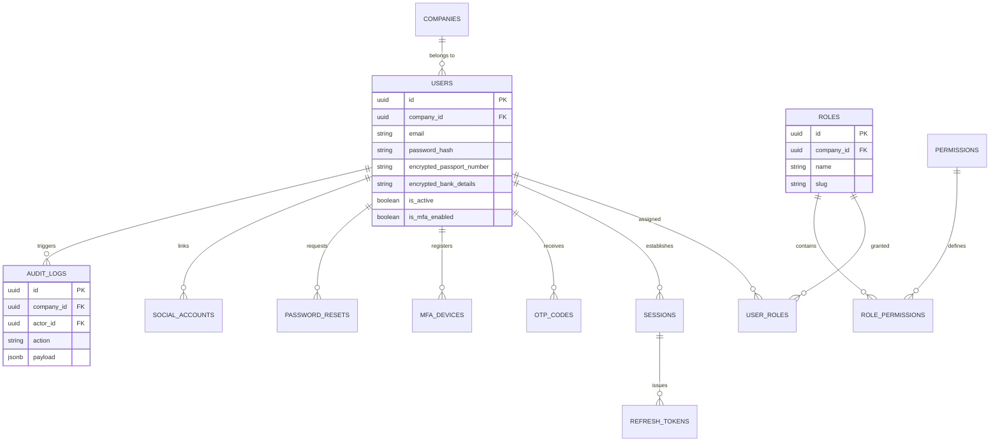
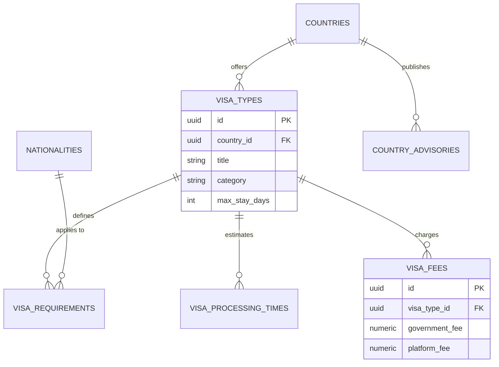
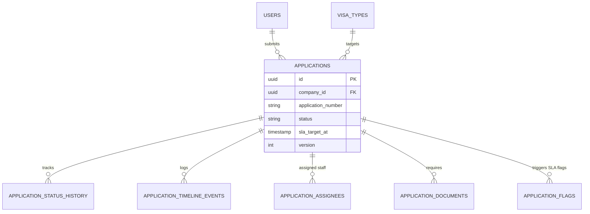
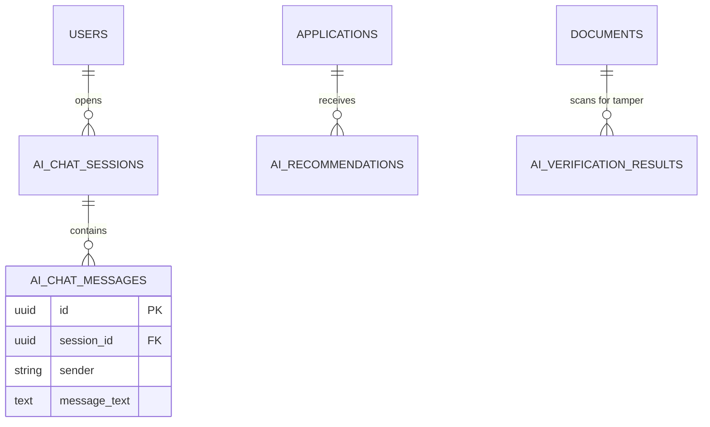
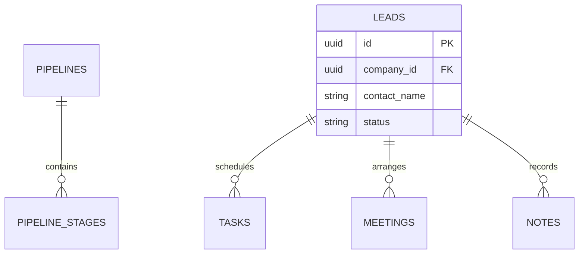
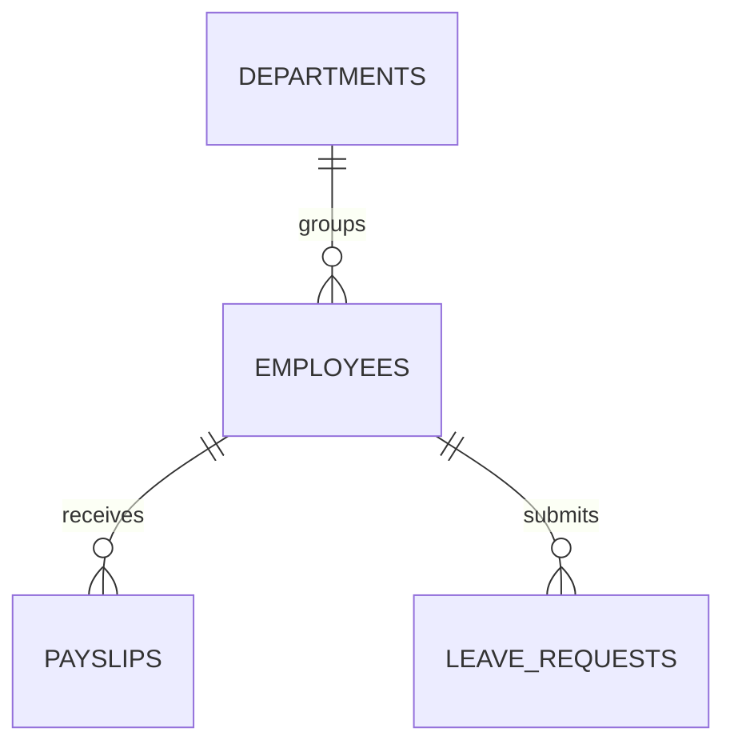
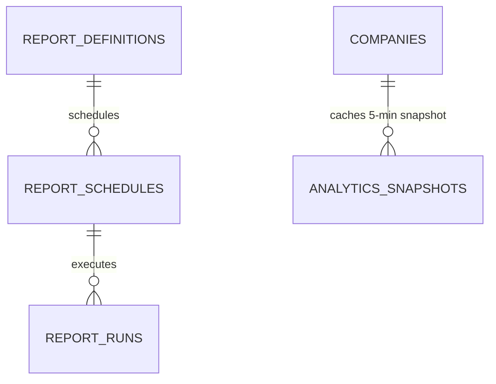
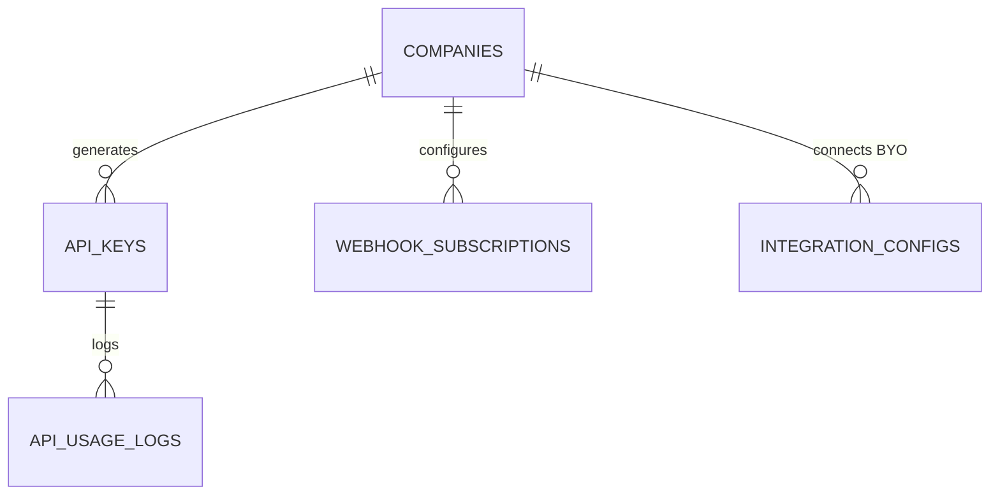
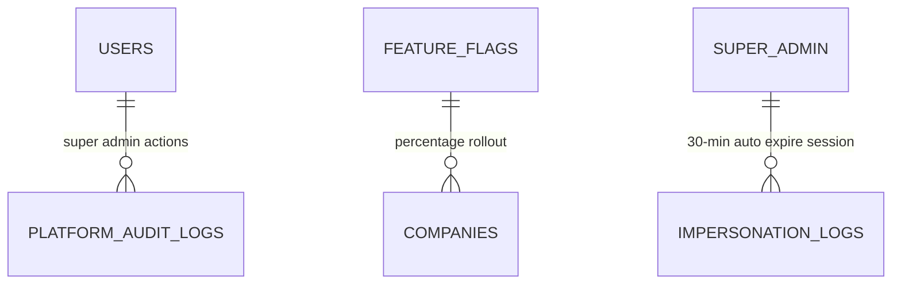

# PHANTOM VISA OS — ENTITY RELATIONSHIP DIAGRAM (ERD)

This document contains the living Mermaid Entity Relationship Diagrams across all **13 domains** in PHANTOM VISA OS.

---

## 1. Identity & Access Control Domain



---

## 2. Company & Tenant Domain

```mermaid
erDiagram
    SUBSCRIPTION_PLANS ||--o{ COMPANIES : "gates"
    COMPANIES ||--o1 COMPANY_KYC : "verifies"
    COMPANIES ||--o{ COMPANY_SUBSCRIPTIONS : "subscribes"
    COMPANIES ||--o1 COMPANY_BRANDING : "styles"
    COMPANIES ||--o1 WHITE_LABEL_CONFIGS : "configures BYO"
    COMPANIES ||--o{ COMPANY_DOMAINS : "owns"
    COMPANIES ||--o{ COMPANY_SETTINGS : "stores"

    SUBSCRIPTION_PLANS {
        uuid id PK
        string name
        int tier_level
        numeric monthly_price
        jsonb features
    }
    WHITE_LABEL_CONFIGS {
        uuid id PK
        uuid company_id FK
        boolean byo_smtp_enabled
        boolean byo_payment_enabled
        boolean byo_sms_enabled
    }
```

---

## 3. Visa Catalog Domain



---

## 4. Applications & Lifecycle Domain



---

## 5. Documents & OCR Domain

```mermaid
erDiagram
    DOCUMENTS ||--o1 DOCUMENT_VERIFICATIONS : "verifies"
    DOCUMENTS ||--o1 OCR_EXTRACTIONS : "extracts"
    DOCUMENTS ||--o1 MRZ_DATA : "parses"
    DOCUMENTS ||--o1 DOCUMENT_QUALITY_SCORES : "evaluates"

    DOCUMENTS {
        uuid id PK
        uuid company_id FK
        string file_name
        string storage_path
    }
    MRZ_DATA {
        uuid id PK
        uuid document_id FK
        string document_number
        date expiry_date
        boolean checksum_valid
    }
```

---

## 6. AI Consular & Verification Domain



---

## 7. CRM Domain



---

## 8. Finance & Wallet Domain (Append-Only)

```mermaid
erDiagram
    COMPANIES ||--o1 WALLETS : "holds"
    WALLETS ||--o{ WALLET_TRANSACTIONS : "append-only log"
    WALLETS ||--o{ WALLET_RECHARGES : "recharges"
    COMPANIES ||--o{ INVOICES : "issues"
    INVOICES ||--o{ INVOICE_LINE_ITEMS : "details"
    APPLICATIONS ||--o{ REFUNDS : "initiates"

    WALLETS {
        uuid id PK
        uuid company_id FK
        numeric balance
        numeric credit_limit
    }
    WALLET_TRANSACTIONS {
        uuid id PK
        uuid wallet_id FK
        numeric signed_amount
        numeric balance_after
    }
    REFUNDS {
        uuid id PK
        numeric amount
        boolean requires_maker_checker
        uuid initiated_by FK
        uuid approved_by FK
    }
```

---

## 9. Notifications Domain

```mermaid
erDiagram
    NOTIFICATION_TEMPLATES ||--o{ NOTIFICATION_LOGS : "formats"
    USERS ||--o1 NOTIFICATION_PREFERENCES : "configures"
    USERS ||--o{ PUSH_TOKENS : "registers"
```

---

## 10. HR Domain



---

## 11. Reports & Pre-Aggregated Analytics Domain



---

## 12. API Marketplace & Integrations Domain



---

## 13. Super Admin & Platform Control Domain


